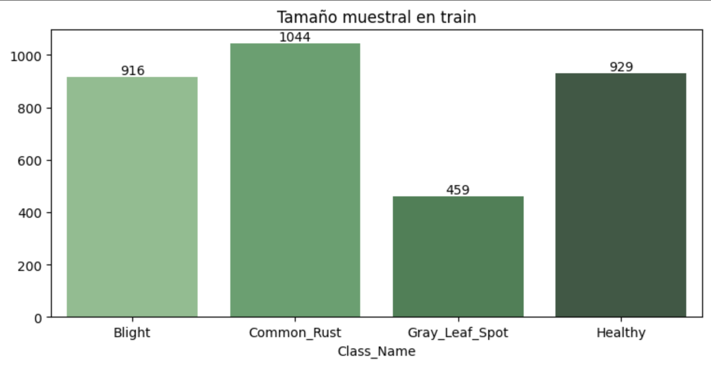
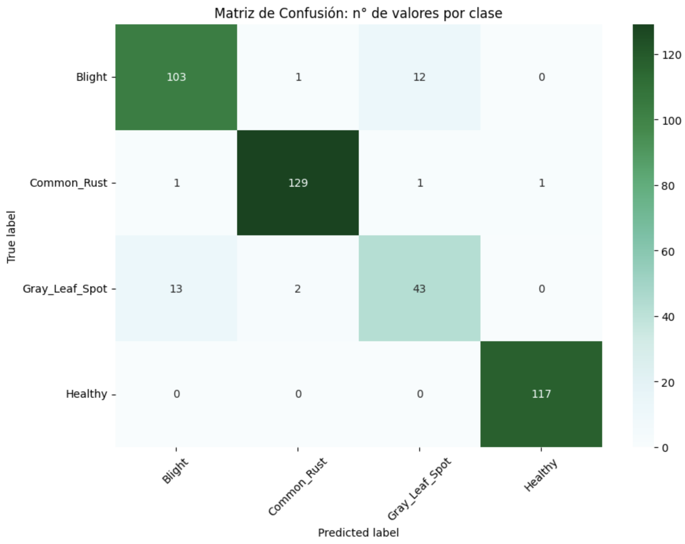

# **Clasificación de enfermedades en cultivos de maíz**

## **Contexto**

El cultivo de maíz en Argentina desempeña un rol fundamental en la economía agrícola del país, siendo una de las principales fuentes de ingresos para los productores y un recurso clave para la industria alimentaria y de biocombustibles. Sin embargo, este cultivo se enfrenta a diversos desafíos, entre los cuales las enfermedades representan una de las mayores amenazas para su rendimiento y calidad.

Las enfermedades en el maíz tienen su origen en múltiples agentes patógenos, como hongos, bacterias, virus y nematodos, que encuentran condiciones propicias en determinados climas, prácticas agrícolas y sistemas de manejo de cultivos. Entre las enfermedades más comunes se encuentran la ***Common Rost*** o Roya Común (causada por *Puccinia sorghi*), ***Gray Leaf Spot*** 0 Mancha Gris de la hoja (causada por *Cercospora zeae-maydis*), y ***Blight*** o marchitamiento bacteriano del maíz/marchitez de Stewart (causada por *Pantoea stewartii*). Estas patologías pueden propagarse rápidamente bajo condiciones ambientales favorables, como alta humedad y temperaturas moderadas, lo que hace imperativa su identificación y gestión tempranas.

Detectar y clasificar las enfermedades del maíz a tiempo es crucial debido al impacto significativo que estas tienen en el rendimiento del cultivo. Las infecciones no controladas pueden reducir drásticamente la productividad, afectar la calidad del grano y aumentar los costos de producción debido a la necesidad de tratamientos intensivos y tardíos. Además, la proliferación de enfermedades puede comprometer la sostenibilidad de los sistemas agrícolas, generando pérdidas económicas para los productores y reduciendo la disponibilidad de maíz en el mercado interno y externo.

En este contexto, el uso de herramientas tecnológicas avanzadas, como la inteligencia artificial y los sistemas de visión por computadora, emerge como una solución innovadora y eficaz para abordar este desafío. La implementación de modelos de clasificación de imágenes permite identificar de manera precisa y oportuna las enfermedades en las plantas, facilitando la toma de decisiones informadas y la aplicación de medidas correctivas antes de que los daños sean irreversibles.

Por lo tanto, el desarrollo de un sistema de clasificación para detectar enfermedades en cultivos de maíz no solo tiene el potencial de mejorar el manejo agrícola en Argentina, sino que también contribuye al fortalecimiento de la seguridad alimentaria y la sostenibilidad económica del sector. Este proyecto busca ser un aporte en ese sentido, integrando tecnología de vanguardia para resolver un problema crítico en la agricultura moderna.

## **Resultados y Métricas**

### Distribución por Clase

Observamos que nuestro dataset está ***desbalanceado***, contamos con un tamaño muestral minoritario para la clase `Gray_Leaf_Spot`. Esta problemática se ve reflejada en el Recall y Precision, dónde dichas métricas son las mas bajas para ésta categoría.

### 📊 Métricas

Como el objetivo de este proyecto es obtener un modelo robusto y bien equilibrado para el uso en producción, **MobileNet** es la mejor opción,
ya que su desempeño más alto en validación sugiere que está menos propenso a sobreajuste (overfitting) y es más estable.

MobileNet tiene mejor desempeño en validación, con un +2% en Accuracy, Precision y Recall respecto a MobileNetV2.

Modelo ***MobileNet***: 
* ***Accuracy*** : 93%
* ***Precision*** : 93%
* ***Recall*** : 93%

### Matriz de Confusion

### 🎯 Resultados

* Rendimiento general: El modelo muestra un buen desempeño con alta precisión en la mayoría de las clases. 
* ***Common Rust*** y ***Healthy*** están bien clasificadas. 
* El modelo clasifica correctamente los ***cultivos sanos el 100%*** de las veces. 
* El modelo clasifica correctamente los ***cultivos enfermos el 90.16%*** de las veces. 
* El modelo ***distingue entre sano y enfermo con un 92.89%*** de precisión.

Incrementando el tamaño muestral para la clase minoritaría `Gray_Leaf_Spot` aumentaría el rendimiento del modelo, disminuyendo el error en las predicciones de dicha categoría.

## **쯇or que usar IA para detectar enfermedades en cultivos de Maiz?**

El uso de Inteligencia Artificial (IA) en la detección de enfermedades en cultivos de maíz representa\
un avance significativo en la agricultura de precisión, permitiendo a los productores mejorar la salud\
de sus cultivos y optimizar la toma de decisiones.

🔍 **Detección temprana y precisa**: Los modelos de IA, como redes neuronales convolucionales (CNN),\
pueden identificar patrones sutiles en imágenes de hojas que serían difíciles de detectar a simple vista,\
permitiendo un diagnóstico oportuno.

🚀 **Eficiencia y rapidez**: La automatización del proceso de detección reduce el tiempo y los recursos necesarios\
para inspeccionar los cultivos manualmente, optimizando el trabajo del productor.

📈 **Reducción de pérdidas económicas**: Al identificar enfermedades en una etapa temprana,\
los agricultores pueden tomar medidas preventivas y minimizar pérdidas en la producción.

🌍 **Agricultura sostenible**: Un diagnóstico más preciso permite aplicar tratamientos específicos,\
reduciendo el uso innecesario de pesticidas y promoviendo prácticas más sostenibles.

📡 **Accesibilidad y escalabilidad**: Con modelos implementados en aplicaciones móviles o plataformas web,\
cualquier productor puede obtener un diagnóstico instantáneo con solo una imagen, sin necesidad de equipos costosos.

La IA no solo mejora la productividad, sino que también transforma la agricultura en una práctica más eficiente,\
sostenible y accesible. 🚜🌱

## App 
Accede y utiliza de manera gratuita nuestra app en Streamlit [***AgroDisease Detector🌽***](https://santiriccardi-corn-disease-detector-appapp-y2eo9o.streamlit.app/)
